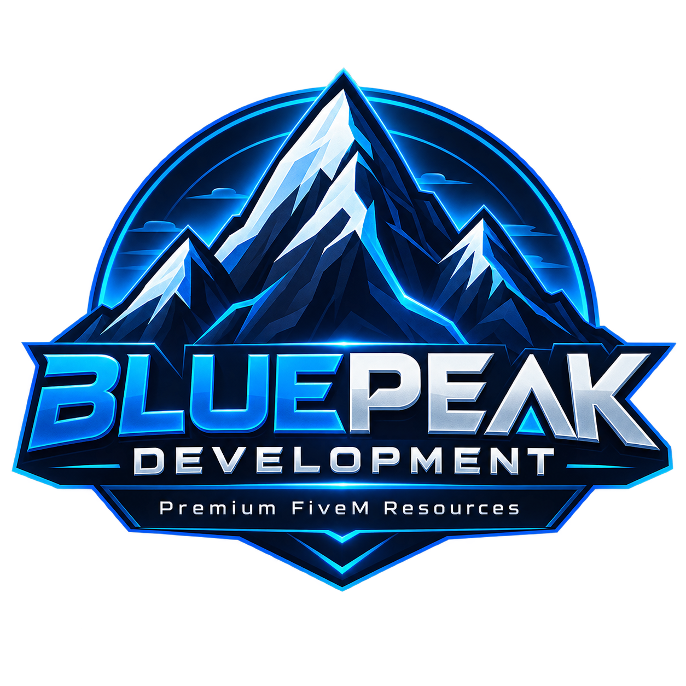

BluePeak Development / Inventory

# Inventory, made yours.

Inventory, equipment, and vehicle storage for your QBCore server.
{ .bp-lead }

Set up your resource, tune the gameplay, and build integrations with a practical guide to every public export.

[Get started](installation.md){ .md-button .md-button--primary }
[Explore the API](functions/server.md){ .md-button }

<a class="bp-card" href="installation/"><strong>01 · Install your resource →</strong>Dependencies, database setup, and your first launch.</a>
<a class="bp-card" href="configuration/"><strong>02 · Make it your own →</strong>Adjust weights, storage limits, jobs, and controls.</a>
<a class="bp-card" href="guides/equipment/"><strong>03 · Explore the equipment →</strong>Persistent backpacks, armor, and the protected slot.</a>
<a class="bp-card" href="functions/server/"><strong>04 · Build an integration →</strong>Server exports, parameters, return values, and Lua examples.</a>

## One resource. Every kind of storage.

| System | What it provides |
| --- | --- |
| Everyday inventory | Configurable pockets, stashes, shops, item drops, and attachments. |
| Backpacks | Persistent item IDs and server-side nesting prevention. |
| Equipment | Armor durability and a protected sixth slot bound to key 6. |
| Vehicles | Five-slot gloveboxes, forty-slot trunks, and vehicle weight overrides. |
| Weapon racks | Glovebox-mounted storage for configured jobs. |

## Before you begin

Keep the resource folder named **`qb-inventory`**. All integration examples use that name. This resource uses the QBCore inventory API; ox_inventory exports are not interchangeable.

New to the resource? Start with [Installation](installation.md), then register your [items](items.md). For a specific issue, visit [Troubleshooting](troubleshooting.md).

The custom inventory release is credited to **FlameOptics**. See [Credits and license](credits.md) for project attribution and redistribution terms.

